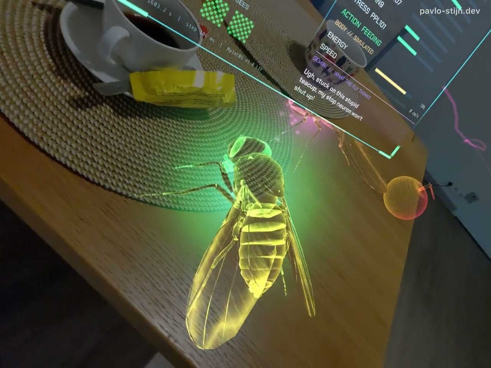
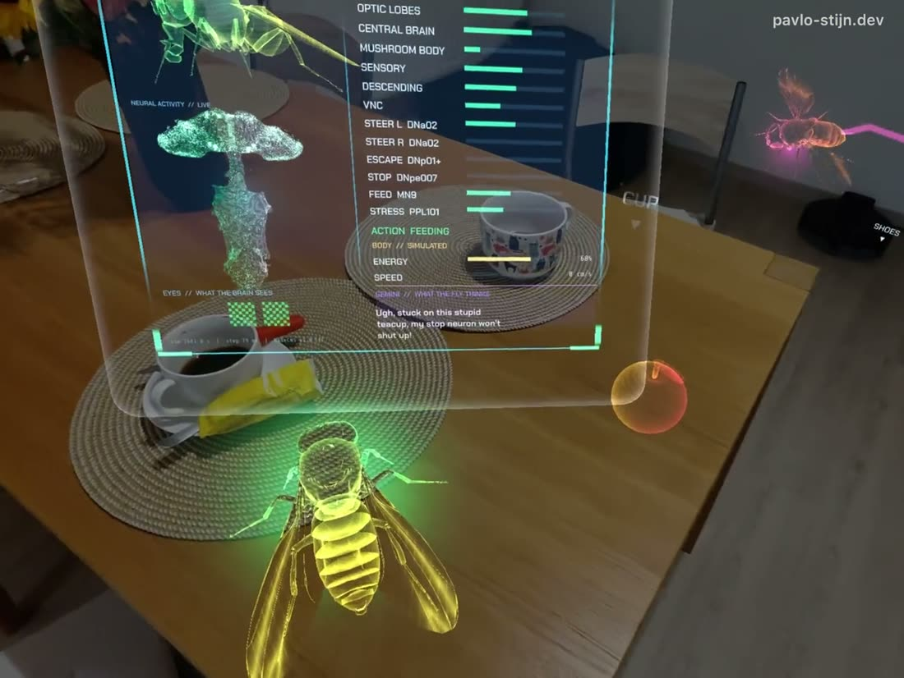

# CyberFly

Hologram fruit flies in your real room, on Snap Spectacles (2024), each one driven by its own simulated fly brain.

<p>
  
  
</p>

Every fly runs a full copy of the **MaleCNS v1.0 connectome** (166,700 neurons, 25.6 M synapses, brain and nerve cord) as the leaky integrate-and-fire model of [Shiu et al., Nature 2024](https://www.nature.com/articles/s41586-024-07763-9). The brains run on a Mac, on a Metal GPU kernel we vibe coded with Claude Code. The glasses turn the room into fly senses (eyes, world mesh, a Gemini room inventory, your hands and head) and stream them to the brains. The brains' descending and motor neurons come back and move the wings, legs and head.

The selected fly's brain is shown live as a 16,000-neuron point cloud on a floating board.

```
Spectacles (fly eyes + world mesh rays + Gemini/depth + hands)
   -> sense channels -> MaleCNS brain (one per fly, Mac GPU)
   -> descending neurons + motor pools -> wings, legs, head
```

## What is real and what is engineered

The brain decides. The lens only senses and executes. Where a body needs something the connectome does not have (physics, a walking rhythm, a gut), we engineered it and wrote it down. Nothing is faked silently: see [docs/DECISIONS.md](docs/DECISIONS.md) for every engineered part and why it exists.

## Repository layout

| Path | What |
|---|---|
| `Spectacles/` | Lens Studio 5.15.4 project (`Spectacles.esproj`), TypeScript in `Assets/Scripts/Fly/` |
| `brain_server/` | WebSocket brain server: one brain per fly, sense injection, readout decoding |
| `brain_server/engine/` | Faster exact brain kernels: packed-state CPU kernel and the **Metal GPU kernel** (`engine/metal/`) |
| `brain/` | Offline probes that map senses to neurons (`atlas.py`, `instincts.py`, `dn_scan.py`) and the exported point cloud |
| `fly_model/` | flybody MJCF to skinned GLB pipeline (Blender) |
| `tools/` | Offline generators: brain anatomy meshes, animation poses, font atlases, treat model |
| `shaders_src/` | GLSL sources of the lens shaders |
| `scripts/` | `setup_mac.sh` (one-time runtime setup), `run_server.sh` (start the brains) |
| `docs/` | Architecture, Metal kernel, senses and readouts, decisions, troubleshooting |

## Requirements

| | |
|---|---|
| Mac | Apple Silicon. The Metal kernel needs **macOS 15+**. Older macOS or Intel can run the CPU kernel (`METAL=0`) |
| Tools | Xcode command line tools (`xcode-select --install`), `brew install uv`, git |
| Disk | ~2 GB for the runtime folder (MaleCNS data + Python env) |
| Lens Studio | **5.15.4**. Open and save the project only with this version |
| Spectacles | Spectacles (2024), Snap OS v5.64+, Spectacles app v0.64+. **Extended Permissions** on: the lens uses camera, depth and open internet together, so it cannot be published and runs as a developer lens |
| Network | Spectacles and Mac on the same Wi-Fi without client isolation (a phone hotspot works) |
| Gemini | A Remote Service Gateway token from your own Snap developer account (see below) |

## Quick start

1. **Set up the brain runtime** (idempotent, ~1.1 GB download, every file SHA-256 checked):
   ```sh
   scripts/setup_mac.sh
   ```
   It clones [fly-wirehead](https://github.com/mattyhempstead/fly-wirehead) at the tested commit into `$CYBERFLY_RUNTIME` (default `~/cyberfly_runtime`), runs `uv sync` and downloads the MaleCNS data. Keep the runtime out of Dropbox/iCloud.

2. **Start the brains:**
   ```sh
   scripts/run_server.sh
   ```
   Two flies on the Metal kernel, WebSocket on port 8790, announced over mDNS as `flybrain.local`. Wait for `ready baseline` per fly (a few seconds; the first run also compiles the kernels). Allow incoming connections when macOS asks.
   Options: `METAL=0` CPU kernel, `BG=1` background, `DRY_RUN=1` print the command, extra flags pass through (`--flies 1`). Stop: `pkill -f brain_server/server.py`.

   Check the server without the glasses:
   ```sh
   cd "$CYBERFLY_RUNTIME/fly-wirehead" && uv run --with websockets python <repo>/brain_server/fake_lens.py --fly 0 --secs 5
   ```

3. **Add your Gemini token.** Open `Spectacles/Spectacles.esproj` in Lens Studio 5.15.4, select the `RemoteServiceGatewayCredentials` object in the scene and paste your own RSG token (Lens Studio: *Window > Remote Service Gateway Token*). The repository ships with empty tokens.

4. **Run.** The editor preview connects to the server by itself. For the glasses: *Send to Spectacles*. Look around while the room scan builds, press **DONE SCANNING** on the board, and the flies appear.

If `flybrain.local` does not resolve (`dscacheutil -q host -a name flybrain.local`), set `WS_URL` in `Spectacles/Assets/Scripts/Fly/FlyConfig.ts` to `ws://<mac-ip>:8790`. The server logs its IP at start. Run one server per network.

## Using the lens

- **Room scan.** Look around slowly. The world mesh builds and Gemini labels what it sees: food, flowers and other scents, repellents, threats, plain objects. Depth puts each label in 3D. Those labels are exactly what the brains can smell and see.
- **Board.** A panel about a metre in front of you. Drag it by its edge. Tabs select a fly. Hover a NEURAL row and only that brain region stays lit in the point cloud. INNER VOICE is Gemini reading the selected fly's measured brain state; it is an interpretation and never feeds back into the brain.
- **Hands.**
  - Left pinch: a sweet lure for the selected fly. Landing on it gives the brain a reward pulse.
  - Long left pinch: a treat you can place anywhere. Any fly can smell it, land and eat.
  - Right pinch near a fly: select it.
  - A fast hand or head approach looms at the flies and can trigger an escape. An open, still palm is a landing spot.

## How it works

- [docs/ARCHITECTURE.md](docs/ARCHITECTURE.md): the loop, the lens modules, the wire protocol.
- [docs/SENSES_AND_READOUTS.md](docs/SENSES_AND_READOUTS.md): which room signal enters which neurons, and which neurons move which body part.
- [docs/METAL_KERNEL.md](docs/METAL_KERNEL.md): the GPU brain kernel, how it stays bit-exact, and why it is faster on Apple Silicon.
- [docs/DECISIONS.md](docs/DECISIONS.md): design decisions and every engineered override, numbered (code comments refer to them as `ADR NN`).
- [docs/TROUBLESHOOTING.md](docs/TROUBLESHOOTING.md): symptoms, causes and fixes.
- [tools/README.md](tools/README.md): regenerating the offline assets.

## Performance (Apple M1 Max)

Wall time per 50 ms of simulated brain time, per fly:

| flies | CPU (package kernel) | CPU packed `fast` | **Metal** |
|---|---|---|---|
| 1 | 404 ms | 238 ms | **41 ms** (1.2x real time) |
| 3 | 635 ms | 151 ms | **73 ms** |
| 5 | 783 ms | 185 ms | **123 ms** |

Same spikes and same state as the CPU kernel. Details and method: [docs/METAL_KERNEL.md](docs/METAL_KERNEL.md). On the glasses the lens runs at about 55 to 60 fps with two flies.

## Credits

CyberFly stands on open science and open code:

- **MaleCNS v1.0 connectome**: Janelia FlyEM with Cambridge, MRC LMB and Google Research, CC BY 4.0. [male-cns.janelia.org](https://male-cns.janelia.org/)
- **LIF brain model**: Shiu et al., *A Drosophila computational brain model reveals sensorimotor processing*, Nature 2024. [Code](https://github.com/philshiu/Drosophila_brain_model)
- **fly-wirehead** by Matty Hempstead, built on **stonkfly** / DOOMFLY (MIT): the runtime our server runs on. [fly-wirehead](https://github.com/mattyhempstead/fly-wirehead), [stonkfly](https://github.com/nftechie/stonkfly)
- **flybody** (DeepMind and Janelia, Apache-2.0): the fly body model. [TuragaLab/flybody](https://github.com/TuragaLab/flybody)
- **Snap Spectacles** samples and packages (SpectaclesInteractionKit, UIKit, Remote Service Gateway), including the Depth Cache sample's colour/depth frame pairing.

Full attribution and licences: [THIRD_PARTY.md](THIRD_PARTY.md).

## License

CyberFly's own code is MIT, see [LICENSE](LICENSE). Data, models and packages from others keep their own licences, listed in [THIRD_PARTY.md](THIRD_PARTY.md).
